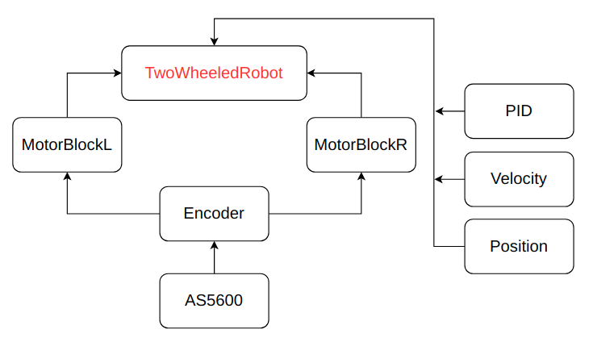
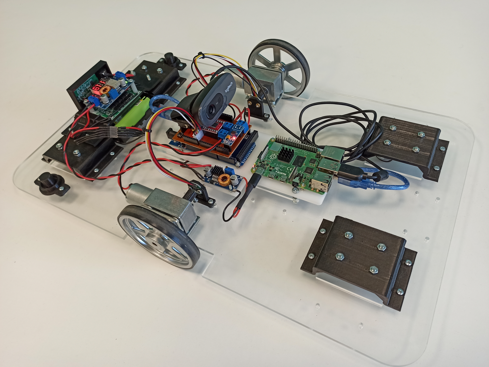

# Differential Drive Robot

This project includes software for controlling a robot with a differential drive.

## Repository structure
```shell
.
├── lib
│   ├── AS5600
│   ├── Encoder
│   ├── InitData
│   ├── Motor
│   ├── PID
│   ├── Position
│   ├── TwoWheeledRobot
│   └── Velocity
├── scripts
│   ├── SocketClient.py
│   └── SocketServer.py
└── src
    └── main.cpp
```

<!-- Classes structure:  
 -->

## Hardware components

<div align="center">
  
</div>

The robot includes the following components:

|      **Component**     |        **Description**       |
| ---------------------- | ---------------------------- |
| **Raspberry pi 4 8gb** | Single-board computer        |
| **Arduino Mega 2560**  | Microcontroller board        |
| **TB6612FNG**          | Motor driver                 |
| **AS5600**             | Hall-Effect magnetic encoder |
| **CJMCU-9548**         | I2C Multiplexer              |

<!-- Below is the connection of all elements -->

## Prerequisites

- [AS5600](https://github.com/RobTillaart/AS5600)  
  This code uses a third party library AS5600 licensed under the MIT License.

- [PlatformioIO](https://platformio.org/)

  For more convenient work with the microcontroller board Arduino Mega 2560 is used PlatformioIO - the tool for working with embedded systems.

  You can download [PlatformIO Core](https://docs.platformio.org/en/latest/core/installation.html#piocore-install-shell-commands) separately OR use the [Visual Studio Code IDE Extension](https://platformio.org/install/ide?install=vscode).

  > [!NOTE]   
  > You do not need to install PlatformIO Core if you are going to use PlatformIO IDE.
  > PlatformIO Core is built into PlatformIO IDE and you will be able to use it within PlatformIO IDE Terminal.

## Installation
Clone the repository:
```shell
git clone https://github.com/AZhed/differential-drive-robot.git &&
cd differential-drive-robot
```
## Usage

Connect remotely to Raspberry Pi using SSH.

### Remote control
Remote control requires that the Raspberry Pi and PC are connected to the same Wi-Fi network.

1. Find out the IP address of your Raspberry Pi.   
  This can be done with the following command:
  ```shell
  ip address show
  ```

2. Check your local IP address: `inet <IP-adress>`  
  This IP address must be specified in the scripts **SocketServer.py** and **SocketClient.py** as a `HOST` variable.

3. Start the Server on Raspberry Pi:
  ```shell
  python3 scripts/SocketServer.py
  ```

4. Start the Client on PC
  ```shell
  python3 scripts/SocketClient.py
  ```

Use the following keys on your keyboard to control the robot:

| **Key** | **Command**                    |
|---------|--------------------------------|
| w       | Move forward                   |
| x       | Move backward                  |
| a       | Turn left                      |
| d       | Turn right                     |
| s       | Stop moving                    |
| e       | Increase the speed             |
| q       | Decrease the speed             |
| Ctrl+С  | Terminate the Сlient or Server |


## License

This project is licensed under the [MIT](./LICENSE).
